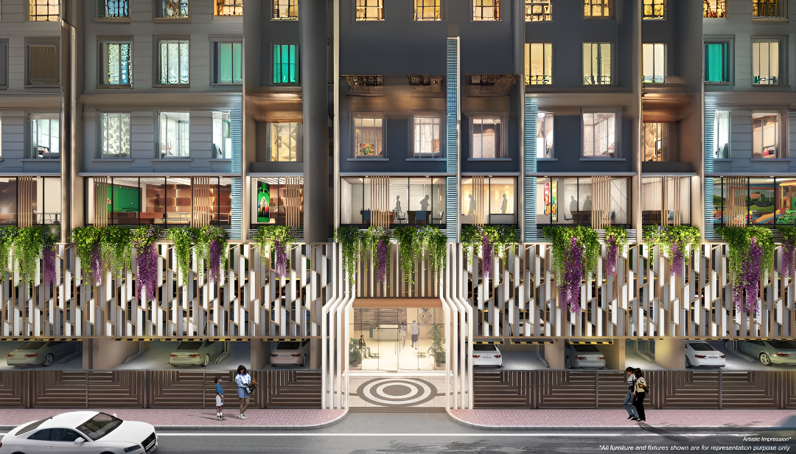

<div align="center">
  
  
  # Swastik Platinum
  
  ✨ **WHERE LEGENDS LIVE** ✨
  
  <p align="center">
    
    
    
  </p>
  
  <p align="center">
    
    
    
  </p>
</div>

<br />

<div align="center">
  
</div>

<br />

## 🏰 About The Project

**Swastik Platinum** is a luxury residential project located in the heart of Vikhroli, Mumbai. This responsive website showcases the elegance and sophistication of premium living spaces where modern architecture meets timeless luxury.

### ✨ Key Highlights

- 🏗️ **22 Storey Magnificent Tower**
- 🏠 **1, 2, and 2.5 BHK Configurations**
- 🌳 **Views of National Park**
- 📍 **Prime Location in Vikhroli**
- 🏊‍♂️ **World-Class Amenities**
- 🔐 **MahaRERA Registered**

## 🚀 Features

### 💫 Responsive Design
- Seamlessly adapts to all screen sizes
- Mobile-first approach
- Optimized for performance

### 🎨 Modern UI/UX
- Elegant animations
- Interactive gallery
- Smooth scrolling navigation
- Premium visual elements

### 🏗️ Technical Excellence
- Fast loading times with Vite
- Component-based architecture
- Tailwind CSS for styling
- SEO optimized

## 🛠️ Built With

- **[React](https://reactjs.org/)** - Frontend library
- **[Tailwind CSS](https://tailwindcss.com/)** - Utility-first CSS framework
- **[Vite](https://vitejs.dev/)** - Build tool
- **[React Icons](https://react-icons.github.io/react-icons/)** - Icon library
- **[Framer Motion](https://www.framer.com/motion/)** - Animation library

## 🚦 Getting Started

### Prerequisites

- Node.js (v14 or higher)
- npm or yarn

### Installation

1. Clone the repository
   ```bash
   git clone https://github.com/pradumya004/Swastik-Platinum.git
   ```

2. Navigate to the project directory
   ```bash
   cd Swastik-Platinum
   ```

3. Install dependencies
   ```bash
   npm install
   # or
   yarn install
   ```

4. Start the development server
   ```bash
   npm run dev
   # or
   yarn dev
   ```

5. Open your browser and visit `http://localhost:5173`

## 📱 Accessing from Multiple Devices

To access the website from multiple devices (phones, tablets, laptops) on the same network:

### 🌐 Local Network Access

1. **Start the development server with host flag:**
   ```bash
   npm run dev -- --host
   # or
   yarn dev --host
   ```

2. **Find your local IP address:**
   - **Windows**: Open Command Prompt and type `ipconfig`
   - **Mac/Linux**: Open Terminal and type `ifconfig` or `ip addr`
   - Look for IPv4 Address (usually starts with 192.168.x.x)

3. **Access from other devices:**
   - Connect all devices to the same WiFi network
   - Open browser on any device
   - Navigate to: `http://YOUR_IP_ADDRESS:5173`
   - Example: `http://192.168.1.100:5173`

### 📡 Quick Access Tips

- **Create a QR Code**: Generate a QR code with your local URL for easy mobile access
- **Bookmark the URL**: Save the local network URL on each device
- **Network Requirements**: Ensure all devices are on the same network/WiFi
- **Firewall Settings**: Allow Vite through your firewall if prompted

### 🔧 Vite Configuration for Network Access

Add to `vite.config.js` for permanent network access:

```javascript
export default defineConfig({
  plugins: [react()],
  server: {
    host: true, // Listen on all addresses
    port: 5173,
    strictPort: true,
  }
})
```

## 📁 Project Structure

```
Swastik
├─ eslint.config.js
├─ index.html
├─ package-lock.json
├─ package.json
├─ postcss.config.js
├─ README.md
├─ src
│  ├─ App.css
│  ├─ App.jsx
│  ├─ assets
│  │  ├─ brochure.pdf
│  │  ├─ images
│  ├─ components
│  │  ├─ common
│  │  │  ├─ Divider.jsx
│  │  │  └─ galleryImages.js
│  │  ├─ layout
│  │  │  ├─ Footer.jsx
│  │  │  ├─ Header.jsx
│  │  │  ├─ MahaRERABanner.jsx
│  │  │  ├─ Navigation.jsx
│  │  │  ├─ PropertyDetails.jsx
│  │  │  └─ WhatsAppButton.jsx
│  │  └─ sections
│  │     ├─ AmenitiesSection.jsx
│  │     ├─ ConfigurationsSection.jsx
│  │     ├─ ContactSection.jsx
│  │     ├─ GallerySection.jsx
│  │     ├─ HeroBanner.jsx
│  │     ├─ LocationSection.jsx
│  │     ├─ OverviewSection.jsx
│  │     └─ SiteProgressSection.jsx
│  ├─ index.css
│  └─ main.jsx
├─ tailwind.config.js
└─ vite.config.js
```

## 🖼️ Components Overview

### Layout Components
- **Header** - Navigation bar with company logo
- **Navigation** - Sticky navigation for sections
- **Footer** - Company information and links
- **WhatsAppButton** - Floating contact button

### Section Components
- **HeroBanner** - Landing section with hero image
- **OverviewSection** - Project overview and highlights
- **LocationSection** - Interactive location features
- **ConfigurationsSection** - Floor plans and unit details
- **AmenitiesSection** - Premium amenities showcase
- **GallerySection** - Image and video gallery
- **SiteProgressSection** - Construction updates
- **ContactSection** - Contact information and team

## 🎯 Key Features Breakdown

### 🏞️ Gallery System
- Dynamic image loading
- Category-based filtering
- Full-screen modal view
- Auto-scroll functionality
- Video integration

### 📍 Location Features
- Interactive tabs
- Distance indicators
- Google Maps integration
- Accessibility information

### 🏗️ Configuration Display
- Wing-wise floor plans
- Unit availability
- Interactive pricing
- Download functionality

## 📱 Responsive Breakpoints

```css
- sm: 640px   // Mobile landscape
- md: 768px   // Tablet
- lg: 1024px  // Desktop
- xl: 1280px  // Large desktop
- 2xl: 1536px // Extra large screens
```

## 🚀 Deployment

### Build for Production

```bash
npm run build
# or
yarn build
```

The build files will be in the `dist` directory.

### Deploy to GitHub Pages

1. Install gh-pages
   ```bash
   npm install --save-dev gh-pages
   ```

2. Add to package.json
   ```json
   {
     "scripts": {
       "predeploy": "npm run build",
       "deploy": "gh-pages -d dist"
     }
   }
   ```

3. Deploy
   ```bash
   npm run deploy
   ```

## 🤝 Contributing

Contributions are welcome! Please feel free to submit a Pull Request.

1. Fork the Project
2. Create your Feature Branch (`git checkout -b feature/AmazingFeature`)
3. Commit your Changes (`git commit -m 'Add some AmazingFeature'`)
4. Push to the Branch (`git push origin feature/AmazingFeature`)
5. Open a Pull Request

## 📄 License

This project is licensed under the MIT License - see the LICENSE file for details.

## 📞 Contact

**Swastik Group**  
📍 312, Swastik Disa Corporate Park, LBS Marg, Ghatkopar West, Mumbai - 400086  
📞 022 6689 0000  
✉️ sales@swastikgroup.in  
🌐 [www.swastikproperties.in](https://www.swastikproperties.in)

## 👨‍💻 Developer

**Pradumya**  
GitHub: [@pradumya004](https://github.com/pradumya004)

---

<div align="center">
  <sub>Built with ❤️ by Pradumya</sub>
</div>